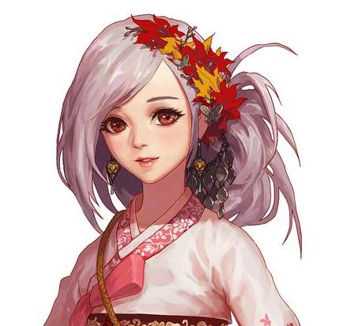
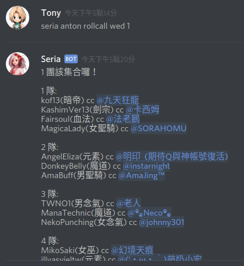
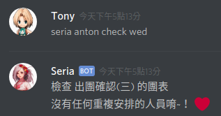
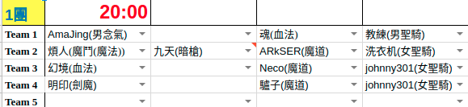

# Seria Bot

Seria whom adventurers first meet is a game NPC in [DFO](https://www.dfoneople.com). She treats everyone with kindness. Adventurers(player) ver like her.

It applied on Discord bot. Because Discord is chat service for player.

# Command & Demo

DFO has big dungeon providing for 20 players to join. Players need to organize a team and beat it.

* rollcall

Seria mentions players at the roll call. It's time to beat the dungeon.

* check

Arranging team member is not a easy task. Especially, leader often consider what combination can defeat dungeon and who are arrange again.

We have a dungeon table records member on Google sheet. Seria bot can access the sheet and check it. If there is any player who is arrange again, Seria will list it.

